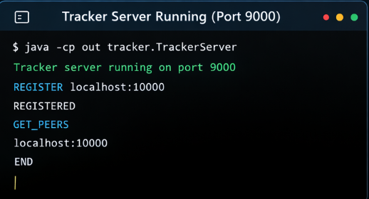
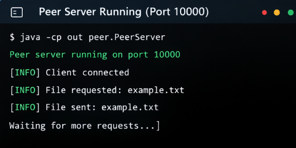
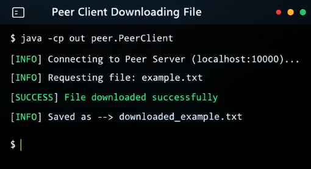
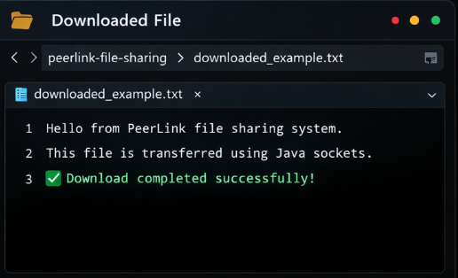

# PeerLink Distributed File Sharing System


PeerLink is a **torrent-style distributed file sharing system built using Java sockets**.

The system allows peers to **discover each other through a tracker server and download files in parallel using chunk-based transfer**, similar to the architecture used in BitTorrent networks.

---

# 🚀 Features

* Peer-to-peer file sharing using Java sockets
* Tracker server for **peer discovery**
* Torrent-style **metadata file (.peerlink)**
* **Chunk-based file transfer**
* **Parallel download using multiple threads**
* Automatic **file reconstruction from chunks**
* Multithreaded peer server

---

# 🏗 System Architecture

```id="architecture"
User
 ↓
Metadata File (.peerlink)
 ↓
Tracker Server
 ↓
Peer Discovery
 ↓
Multiple Peer Servers
 ↓
Parallel Chunk Download
 ↓
Chunk Merge
 ↓
Final File
```

---

# 📂 Project Structure

```id="structure"
peerlink-file-sharing
│
├── metadata
│   └── example.peerlink
│
├── shared
│   └── example.txt
│
├── src
│   ├── peer
│   │   ├── PeerClient.java
│   │   ├── PeerServer.java
│   │   └── ChunkDownloader.java
│   │
│   ├── tracker
│   │   └── TrackerServer.java
│   │
│   └── utils
│       ├── ChunkUtils.java
│       ├── FileUtils.java
│       └── MetadataUtils.java
│
├── assets
│   ├── tracker-running.png
│   ├── peer-server-running.png
│   ├── peer-client-download.png
│   └── peer-transfer.png
│
├── README.md
└── .gitignore
```

---

# 🌐 Components

## Tracker Server

Responsible for **peer discovery**.

Functions:

* Registers peers
* Stores peer addresses
* Returns peer list to clients

---

## Peer Server

Acts as a **file provider**.

Functions:

* Hosts shared files
* Splits files into chunks
* Sends requested chunks to peers

---

## Peer Client

Responsible for **downloading files**.

Functions:

* Reads metadata file
* Requests peer list from tracker
* Downloads chunks in parallel
* Reconstructs final file

---

# 📄 Metadata File

Example:

```id="metadata"
metadata/example.peerlink
```

Content:

```id="metadata-example"
filename=example.txt
chunks=4
chunkSize=1024
tracker=localhost:9000
```

This file tells the client:

* file name
* number of chunks
* chunk size
* tracker location

---

# ⚙️ Running the Project

## Compile

```id="compile"
javac -d out src/peer/*.java src/tracker/*.java src/utils/*.java
```

---

## Start Tracker Server

```id="tracker"
java -cp out tracker.TrackerServer
```

---

## Start Peer Server

```id="peer-server"
java -cp out peer.PeerServer
```

---

## Run Peer Client

```id="peer-client"
java -cp out peer.PeerClient
```

---

# 🖥 Screenshots

## Tracker Server Running



---

## Peer Server Running



---

## Peer Client Downloading File



---

## File Transfer Result



---

# 🧠 Concepts Demonstrated

This project demonstrates:

* Socket programming
* Peer-to-peer networking
* Distributed system architecture
* Chunk-based file transfer
* Parallel downloads
* Metadata-driven file sharing

---

# 🔮 Future Improvements

Possible enhancements:

* File integrity verification using hashing
* Dynamic peer discovery
* Peer reputation system
* GUI interface for file sharing
* Real torrent-style peer exchange

---

# 👨‍💻 Author

**Sahil**

B.Tech Information Technology
Galgotias College of Engineering and Technology

GitHub
https://github.com/sahilsingh78
